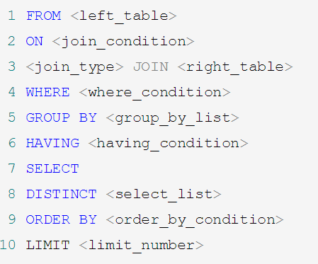
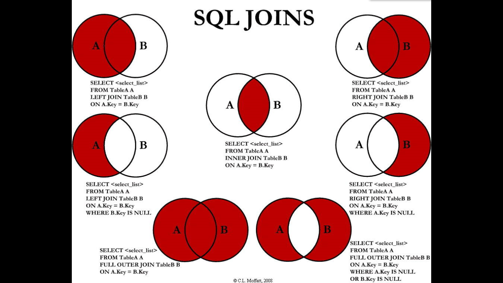

# 常见通用的Join查询

### 1 SQL执行顺序

- 手写

   

- 机读

  随着Mysql版本的更新换代，其优化器也在不断的升级，优化器会分析不同执行顺序产生的性能消耗不同而动态调整执行顺序。

  ​    下面是经常出现的查询顺序：

   

- 总结

   

### 2 Join图

 

共有与独有(理解)：

什么叫共有，什么叫独有？

共有：满足 a.deptid = b.id 的叫共有

A独有:  A 表中所有不满足  a.deptid = b.id  连接关系的数据

同时参考 join 图

### 3 建表SQL
```
CREATE TABLE `t_dept` (

 `id` INT(11) NOT NULL AUTO_INCREMENT,

 `deptName` VARCHAR(30) DEFAULT NULL,

 `address` VARCHAR(40) DEFAULT NULL,

 PRIMARY KEY (`id`)

) ENGINE=INNODB AUTO_INCREMENT=1 DEFAULT CHARSET=utf8;

CREATE TABLE `t_emp` (

 `id` INT(11) NOT NULL AUTO_INCREMENT,

 `name` VARCHAR(20) DEFAULT NULL,

  `age` INT(3) DEFAULT NULL,

 `deptId` INT(11) DEFAULT NULL,

 PRIMARY KEY (`id`),

 KEY `fk_dept_id` (`deptId`)

 \#CONSTRAINT `fk_dept_id` FOREIGN KEY (`deptId`) REFERENCES `t_dept` (`id`)

) ENGINE=INNODB AUTO_INCREMENT=1 DEFAULT CHARSET=utf8;

INSERT INTO t_dept(deptName,address) VALUES('华山','华山');

INSERT INTO t_dept(deptName,address) VALUES('丐帮','洛阳');

INSERT INTO t_dept(deptName,address) VALUES('峨眉','峨眉山');

INSERT INTO t_dept(deptName,address) VALUES('武当','武当山');

INSERT INTO t_dept(deptName,address) VALUES('明教','光明顶');

INSERT INTO t_dept(deptName,address) VALUES('少林','少林寺');

INSERT INTO t_emp(NAME,age,deptId) VALUES('风清扬',90,1);

INSERT INTO t_emp(NAME,age,deptId) VALUES('岳不群',50,1);

INSERT INTO t_emp(NAME,age,deptId) VALUES('令狐冲',24,1);

INSERT INTO t_emp(NAME,age,deptId) VALUES('洪七公',70,2);

INSERT INTO t_emp(NAME,age,deptId) VALUES('乔峰',35,2);

INSERT INTO t_emp(NAME,age,deptId) VALUES('灭绝师太',70,3);

INSERT INTO t_emp(NAME,age,deptId) VALUES('周芷若',20,3);

INSERT INTO t_emp(NAME,age,deptId) VALUES('张三丰',100,4);

INSERT INTO t_emp(NAME,age,deptId) VALUES('张无忌',25,5);

INSERT INTO t_emp(NAME,age,deptId) VALUES('韦小宝',18,null);
```

### 4 七种Join

```
1 A、B两表共有

 select * from t_emp a inner join t_dept b on a.deptId = b.id;

2 A、B两表共有+A的独有

 select * from t_emp a left join t_dept b on a.deptId = b.id;

3 A、B两表共有+B的独有

 select * from t_emp a right join t_dept b on a.deptId = b.id;

4 A的独有 

select * from t_emp a left join t_dept b on a.deptId = b.id where b.id is null; 

5 B的独有

 select * from t_emp a right join t_dept b on a.deptId = b.id where a.deptId is null;  

6 AB全有

\#MySQL Full Join的实现 因为MySQL不支持FULL JOIN,下面是替代方法

 \#left join + union(可去除重复数据)+ right join

SELECT * FROM t_emp A LEFT JOIN t_dept B ON A.deptId = B.id

UNION

SELECT * FROM t_emp A RIGHT JOIN t_dept B ON A.deptId = B.id

 这里因为要联合的缘故，不能考虑到小表驱动大表的情况。只能用right join。要保证查询出来的数字要一致。

7 A的独有+B的独有

​        \* FROM t_emp A LEFT JOIN t_dept B ON A.deptId = B.id WHERE B.`id` IS NULL

UNION

SELECT * FROM t_emp A RIGHT JOIN t_dept B ON A.deptId = B.id WHERE A.`deptId` IS NULL;
```
- 增加掌门字段
```
ALTER TABLE `t_dept` 
add CEO  INT(11)  ;
update t_dept set CEO=2 where id=1;
update t_dept set CEO=4 where id=2;
update t_dept set CEO=6 where id=3;
update t_dept set CEO=8 where id=4;
update t_dept set CEO=9 where id=5;
求各个门派对应的掌门人:
select   * from t_dept as  b left  join t_emp as a on  b.CEO=a.id;
求所有当上掌门人的平均年龄:
select  avg(a.age) from t_emp a inner join t_dept b on a.id=b.CEO  ;
```
- join 的理解例题
```
两者区别两者区别：
思想上的区别：
子查询理解子查询理解：①先知道需要查询并将数据拿出来(若from 后的表也是一个子查询结果)。②在去寻找满足判断条件的数据(where,on,having 后的参数等)。而这些查询条件通常是通过子查询获得的。
子查询是一种根据结果找条件的倒推的顺序。比较好理解与判断
例题中：“人物”在t_emp 表中，所以第一个from 是t_emp 表。(也可以直接将子查询方法 from 后面(因为本题中的子查询中也有select 的数据),所以任然需要上述的推导过程)
join理解join理解：执行完第一步后的结果为一张新表。在将新表与 t_emp 进行下一步的 left join 关联。
先推出如何获得条件，再像算数题一样一步一步往下 join。可以交换顺序，但只能是因为条件间不相互关联时才能交换顺序。
join 比 子查询难一点 
join 能用到索引，但是子查询出来的表会使索引失效。
***求所有人物对应的掌门:
t_dept 表
id  deptName  address       CEO 
 1       华山派          华山          2
...
t_emp 表
id  name     age  deptId 
1  风清扬     90         1
...
1.使用子查询(不推荐，影响后续用索引)使用子查询1.使用子查询(不推荐，影响后续用索引)
步骤：a.创建子查询  查询出每个门派对应的ceo  
         b. 根据t_emp 对应的 deptId 关联子查询表查询出所有人物对应的 ceo
SELECT a.name,f.deptName,f.name FROM t_emp a
LEFT JOIN (SELECT d.`id`,e.`name` ,d.`deptName` FROM t_dept d
LEFT JOIN t_emp e 
ON d.`CEO`=e.`id`) f
ON a.deptId = f.id
2.使用join(推荐)使用join
步骤:a. 关联出每个人物对应的门派
       b.通过门派的 ceo 关联对应的掌门
SELECT e.`name`, d.`deptName`,f.`name` ceo FROM t_dept d
RIGHT JOIN t_emp e
ON d.`id` = e.`deptId`   ##第一步 --->得到关联了部门的一张新的联合表
LEFT JOIN t_emp f   
ON d.`CEO`=f.`id`       ##第二步  --->通过新的联合表中的数据与另一张表关联
SELECT d.`deptName`, e.`name` CEO,d.`id`,f.name
 FROM t_dept d
LEFT JOIN  t_emp e    //上述两个 join 交换了顺序并不影响执行。前提是两个 join 间不是依赖关系。且都跟
ON d.`CEO`=e.`id` 
LEFT JOIN t_emp f
ON f.deptId = d.`id`

```