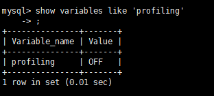
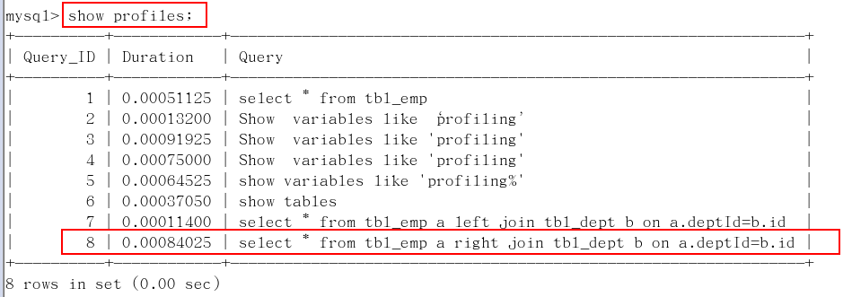
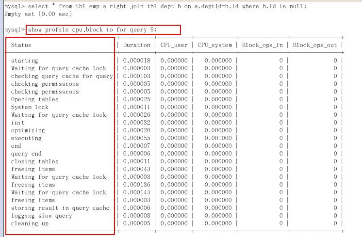

# Show Profile

### 1 是什么

是mysql提供可以用来分析当前会话中语句执行的资源消耗情况。可以用于SQL的调优的测量

### 2 官网

http://dev.mysql.com/doc/refman/5.5/en/show-profile.html

### 3 默认情况

默认情况下，参数处于关闭状态，并保存最近15次的运行结果

### 4 分析步骤

#### 4.1 是否支持，看看当前的mysql版本是否支持

Show  variables like 'profiling';

默认是关闭，使用前需要开启

 

#### 4.2 开启功能，默认是关闭，使用前需要开启

show variables like 'profiling';

set profiling=1;

 

#### 4.3 运行SQL 

select * from emp group by id%10 limit 150000;

select * from emp group by id%20  order by 5

#### 4.4 查看结果，show profiles;

 

#### 4.5 诊断SQL，show profile cpu,block io for query  n  (n为上一步前面的问题SQL数字号码);

 

**参数备注:**

type:  
 | ALL                        --显示所有的开销信息  
 | BLOCK IO                --显示块IO相关开销  
 | CONTEXT SWITCHES --上下文切换相关开销  
 | CPU              --显示CPU相关开销信息  
 | IPC              --显示发送和接收相关开销信息  
 | MEMORY           --显示内存相关开销信息  
 | PAGE FAULTS      --显示页面错误相关开销信息  
 | SOURCE           --显示和Source_function，Source_file，Source_line相关的开销信息  
 | SWAPS            --显示交换次数相关开销的信息

#### 4.6 日常开发需要注意的结论

- converting HEAP to MyISAM 查询结果太大，内存都不够用了往磁盘上搬了。

- Creating tmp table 创建临时表
```
   1 select * from emp group by id%20 limit 120000;
   2 select * from emp group by id%20  order by 5;
```
​		解决: 拷贝数据到临时表, 用完再删除

- Copying to tmp table on disk 把内存中临时表复制到磁盘，危险！！！
- locked