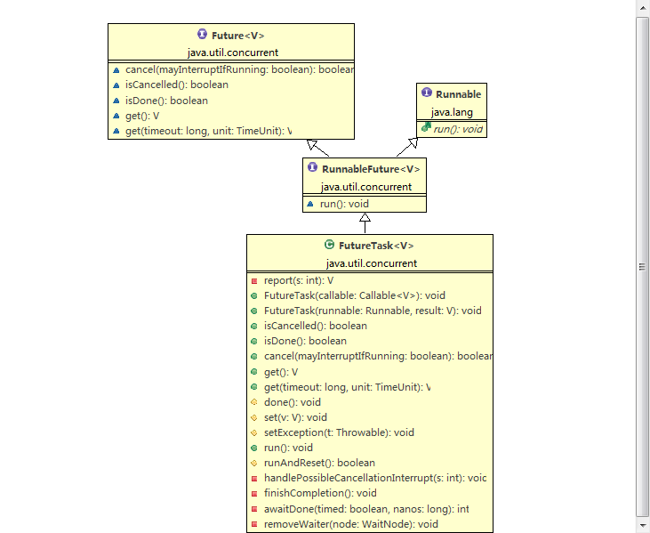

## 线程池使用过吗？谈谈对 ThreadPoolExector 的理解？


[TOC]

### 1 为什使用线程池，线程池的优势？

​	线程池用于多线程处理中，它可以根据系统的情况，有效控制线程执行的数量，优化运行效果。线程池做的工作主要是控制运行的线程的数量，处理过程中将任务放入队列，然后在线程创建后启动这些任务，如果线程数量超过了最大数量，那么超出数量的线程排队等候，等其它线程执行完毕，再从队列中取出任务来执行。

主要特点为：

- 线程复用
- 控制最大并发数量
- 管理线程

主要优点

- 降低资源消耗，通过重复利用已创建的线程来降低线程创建和销毁造成的消耗。
- 提高响应速度，当任务到达时，任务可以不需要等到线程创建就能立即执行。
- 提高线程的可管理性，线程是稀缺资源，如果无限制的创建，不仅仅会消耗系统资源，还会降低系统的稳定性，使用线程可以进行统一分配，调优和监控。

### 2 创建线程的几种方式

- 继承 Thread

```
class MyThread extends Thread{
	@Override
	public void run() {
		System.out.println(Thread.currentThread().getName() + " 继承Thread");
	}
}

public class ThreadDemo01 {
	@Test
	public void test1() {
		MyThread t = new MyThread();
		t.start();
	}
}
```

- 实现 Runnable 接口

```
class MyRunner implements Runnable{

	@Override
	public void run() {
		System.out.println(Thread.currentThread().getName() + " 实现Runnable接口");
	}
}

public class ThreadDemo02 {
	@Test
	public void test2() {
		Thread t = new Thread(new MyRunner());
		t.start();
	}
}
```

- 实现 Callable接口



```
class MyCall implements Callable<String>{

	@Override
	public String call() throws Exception {
		System.out.println(Thread.currentThread().getName() + " 实现Callable接口");
		return "MyCall";
	}
}

public class ThreadDemo03 {
	@Test
	public void test3() {
		FutureTask<String> f = new FutureTask<String>(new MyCall());
		Thread t = new Thread(f);
		t.start();
		try {
			System.out.println(f.get());
		} catch (InterruptedException | ExecutionException e) {
			e.printStackTrace();
		}
	}
}
```

### 3 线程池如果使用？

#### 架构说明


#### 编码实现

- Executors.newSingleThreadExecutor()：只有一个线程的线程池，因此所有提交的任务是顺序执行

```
    public static ExecutorService newSingleThreadExecutor() {
        return new FinalizableDelegatedExecutorService
            (new ThreadPoolExecutor(1, 1,
                                    0L, TimeUnit.MILLISECONDS,
                                    new LinkedBlockingQueue<Runnable>()));
    }
```

- Executors.newCachedThreadPool()：线程池里有很多线程需要同时执行，老的可用线程将被新的任务触发重新执行，如果线程超过60秒内没执行，那么将被终止并从池中删除

```
    public static ExecutorService newCachedThreadPool() {
        return new ThreadPoolExecutor(0, Integer.MAX_VALUE,
                                      60L, TimeUnit.SECONDS,
                                      new SynchronousQueue<Runnable>());
    }
```

- Executors.newFixedThreadPool()：拥有固定线程数的线程池，如果没有任务执行，那么线程会一直等待

```
    public static ExecutorService newFixedThreadPool(int nThreads) {
        return new ThreadPoolExecutor(nThreads, nThreads,
                                      0L, TimeUnit.MILLISECONDS,
                                      new LinkedBlockingQueue<Runnable>());
    }
```

- Executors.newScheduledThreadPool()：用来调度即将执行的任务的线程池

- Executors.newWorkStealingPool()：  newWorkStealingPool适合使用在很耗时的操作，但是newWorkStealingPool不是ThreadPoolExecutor的扩展，它是新的线程池类ForkJoinPool的扩展，但是都是在统一的一个Executors类中实现，由于能够合理的使用CPU进行对任务操作（并行操作），所以适合使用在很耗时的任务中

#### ThreadPoolExecutor

ThreadPoolExecutor作为java.util.concurrent包对外提供基础实现，以内部线程池的形式对外提供管理任务执行，线程调度，线程池管理等等服务。

### 4 线程池的几个重要参数介绍？

| 参数                     | 作用                                                         |
| :----------------------- | :----------------------------------------------------------- |
| corePoolSize             | 核心线程池大小                                               |
| maximumPoolSize          | 最大线程池大小                                               |
| keepAliveTime            | 当线程池中线程数超过corePoolSize，空闲时间超过keepAliveTime的线程会被销毁；当设置allowCoreThreadTimeOut(true)时，任何线程空闲时间超过keepAliveTime后就会被销毁 |
| TimeUnit                 | keepAliveTime 时间单位                                       |
| workQueue                | 阻塞任务队列                                                 |
| threadFactory            | 线程工厂                                                     |
| RejectedExecutionHandler | 当提交任务数超过 maxmumPoolSize+workQueue 之和时，任务会交给RejectedExecutionHandler 来处理 |

### 5 说说线程池的底层工作原理？


### 6 线程池的拒绝策略你谈谈？

- 是什么

  - 等待队列已经满了，再也塞不下新的任务，同时线程池中的线程数达到了最大线程数，无法继续为新任务服务。
- 拒绝策略
  - AbortPolicy：直接抛出RejectedExecutionException异常阻止系统正常运行（默认的拒绝策略）

  - CallerRunsPolicy：该策略既不会抛弃任务，也不会抛出异常，而是将不能执行的任务回退给调用者，从而降低新任务的流量。如果调用者线程已关闭，则会丢弃该任务。

  - DiscardOldestPolicy：抛弃队列中等待最久的任务，然后把当前任务加入队列中尝试再次提交当前任务

  - DiscardPolicy：直接丢弃任务，不予任何处理也不抛出异常。如果允许任务丢失，这是最好的一种方案 

### 7 你在工作中单一的、固定数的和可变的三种创建线程池的方法，你用哪个多，超级大坑？

- 如果读者对Java中的阻塞队列有所了解的话，看到这里或许就能够明白原因了。

- Java中的BlockingQueue主要有两种实现，分别是ArrayBlockingQueue 和 LinkedBlockingQueue。

  - ArrayBlockingQueue是一个用数组实现的有界阻塞队列，必须设置容量。
  
  - LinkedBlockingQueue是一个用链表实现的有界阻塞队列，容量可以选择进行设置，不设置的话，将是一个无边界的阻塞队列，最大长度为Integer.MAX_VALUE。
  
  - 这里的问题就出在：如果我们不设置LinkedBlockingQueue的容量，其默认容量将会是Integer.MAX_VALUE。
  
- `FixedThreadPool`和`SingleThreadPool`允许的任务队列（`workQueue`）长度为Integer.MAX_VALUE，可能会堆积大量请求从而导致OOM

- `CachedThreadPool`和`ScheduledThreadPool`允许创建的线程数量（`maximumPoolSize`）为Integer.MAX_VALUE，可能会创建大量的线程，从而导致OOM

### 8 你在工作中是如何使用线程池的，是否自定义过线程池使用？

自定义线程池

```
public class ThreadPoolExecutorDemo {

    public static void main(String[] args) {
        Executor executor = new ThreadPoolExecutor(2, 3, 1L, TimeUnit.SECONDS,
                new LinkedBlockingQueue<Runnable>(5), 
                Executors.defaultThreadFactory(), 
                new ThreadPoolExecutor.DiscardPolicy());
    }
}
```

### 9 合理配置线程池你是如果考虑的？

- CPU 密集型
  - CPU 密集的意思是该任务需要大量的运算，而没有阻塞，CPU 一直全速运行
  - CPU 密集型任务尽可能的少的线程数量，一般为 CPU 核数 + 1 个线程的线程池
  
- IO 密集型
  - 由于 IO 密集型任务线程并不是一直在执行任务，可以多分配一点线程数，如 CPU * 2 
  - 也可以使用公式：CPU 核数 / (1 - 阻塞系数)；其中阻塞系数在 0.8 ～ 0.9 之间