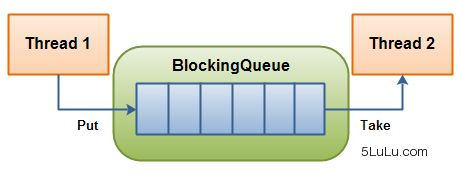

## 堵塞队列你知道吗？

### 阻塞队列有哪些

- ArrayBlockingQueue：是一个基于数组结构的有界阻塞队列，此队列按 FIFO（先进先出）对元素进行排序。
- LinkedBlokcingQueue：是一个基于链表结构的阻塞队列，此队列按 FIFO（先进先出）对元素进行排序，吞吐量通常要高于 ArrayBlockingQueue。
- SynchronousQueue：是一个不存储元素的阻塞队列，每个插入操作必须等到另一个线程调用移除操作，否则插入操作一直处于阻塞状态，吞吐量通常要高于 LinkedBlockingQueue。

### 什么是阻塞队列



- 阻塞队列，顾名思义，首先它是一个队列，而一个阻塞队列在数据结构中所起的作用大致如图所示：

- 当阻塞队列是空时，从队列中获取元素的操作将会被阻塞。

- 当阻塞队列是满时，往队列里添加元素的操作将会被阻塞。

- 核心方法

| 方法类型 |    抛出异常    |      特殊值      |    阻塞     |               超时               |
| :------: | :------------: | :--------------: | :---------: | :------------------------------: |
|   插入   | add(E):boolean | offer(E):boolean | put(E):void | offer(E, long, TimeUnit):boolean |
|   移除   |   remove():E   |     poll():E     |  take():E   |      poll(long, TimeUnit):E      |
|   检查   |  element():E   |     peek():E     |   不可用    |              不可用              |

- 插入方法：

  - add(E e)：添加成功返回true，失败抛IllegalStateException("Queue full")异常
  - offer(E e)：成功返回 true，如果此队列已满，则返回 false
  - put(E e)：将元素插入此队列的尾部，如果该队列已满，则一直阻塞
  - offer(o, timeout, timeunit)：将元素插入此队列的尾部，如果该队列已满，则等待指定时间，插入成功返回true，插入失败返回false

- 删除方法：

  - remove() ：获取并移除此队列的头元素，若队列为空，则抛出NoSuchElementException()异常
  - poll()：获取并移除此队列的头元素，若队列为空，则返回 null
  - take()：获取并移除此队列头元素，若没有元素则一直阻塞
  - poll(timeout, timeunit)：获取并移除此队列头元素，若队列为空，则等待指定时间，移除成功返回true，移除失败返回false

- 检查方法：

  - element() ：获取但不移除此队列的头元素，若队列为空，则抛NoSuchElementException()异常
  - peek() ：获取但不移除此队列的头元素，若队列为空，则返回 null

### SynchronousQueue

SynchronousQueue，实际上它不是一个真正的队列，因为它不会为队列中元素维护存储空间。与其他队列不同的是，它维护一组线程，这些线程在等待着把元素加入或移出队列。

```
public class SynchronousQueueDemo {

    public static void main(String[] args) {
        SynchronousQueue<Integer> synchronousQueue = new SynchronousQueue<>();
        new Thread(() -> {
            try {
                synchronousQueue.put(1);
                Thread.sleep(3000);
                synchronousQueue.put(2);
                Thread.sleep(3000);
                synchronousQueue.put(3);
            } catch (InterruptedException e) {
                e.printStackTrace();
            }
        }).start();

        new Thread(() -> {
            try {
                Integer val = synchronousQueue.take();
                System.out.println(val);
                Integer val2 = synchronousQueue.take();
                System.out.println(val2);
                Integer val3 = synchronousQueue.take();
                System.out.println(val3);
            } catch (InterruptedException e) {
                e.printStackTrace();
            }
        }).start();
    }
}
```

### 阻塞队列使用场景

- 生产者消费者模式
- 线程池
- 消息中间件