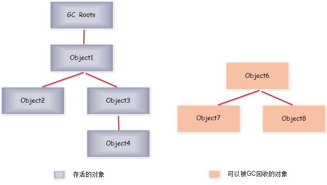

## JVM 垃圾回收的时候如何确定垃圾？知道什么是 GC Roots ?

- 什么是垃圾

	- 简单来说就是内存中已经不再被使用到的空间就是垃圾

- 要进行垃圾回收，如何判断一个对象是否可以被回收？

	- 引用计数法
	- 枚举根节点做可达性分析

- 为了解决引用计数法的循环引用问题，Java 使用了可达性算法。

跟踪收集器采用的为集中式的管理方式，全局记录对象之间的引用状态，执行时从一系列GC  Roots对象作为起点，从这些节点向下开始进行搜索所有的引用链，当一个对象到GC  Roots没有任何引用链相连时，则证明此对象是不可用的。

图中，对象Object6、Object7、Object8虽然互相引用，但他们到GC Roots是不可到达的，所以它们将会被判定为是可回收的对象。

- 哪些对象可以作为 GC Roots 的对象：

	- 虚拟机栈（栈帧中的局部变量区，也叫局部变量表）中引用的对象
	- 方法区中的类静态属性引用的对象
	- 方法区常量引用的对象
	- 本地方法栈中`JNI` (`JNI`是Java Native Interface的缩写)引用的对象