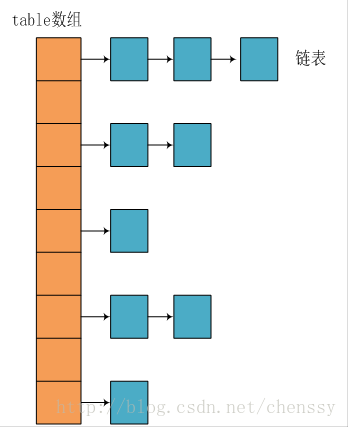

## HashMap的底层实现

### JDK1.8之前

JDK1.8 之前 `HashMap` 底层是 **数组和链表** 结合在一起使用也就是 **链表散列**。**HashMap 通过 key 的 hashCode 经过扰动函数处理过后得到 hash 值，然后通过 (n - 1) & hash 判断当前元素存放的位置（这里的 n 指的是数组的长度），如果当前位置存在元素的话，就判断该元素与要存入的元素的 hash 值以及 key 是否相同，如果相同的话，直接覆盖，不相同就通过拉链法解决冲突。**

**所谓扰动函数指的就是 HashMap 的 hash 方法。使用 hash 方法也就是扰动函数是为了防止一些实现比较差的 hashCode() 方法造成的碰撞，换句话说使用扰动函数之后可以减少碰撞。**

**JDK 1.8 HashMap 的 hash 方法源码:**

JDK 1.8 的 hash方法 相比于 JDK 1.7 hash 方法更加简化，但是原理不变。

```
    static final int hash(Object key) {
      int h;
      // key.hashCode()：返回散列值也就是hashcode
      // ^ ：按位异或
      // >>>:无符号右移，忽略符号位，空位都以0补齐
      return (key == null) ? 0 : (h = key.hashCode()) ^ (h >>> 16);
  }
```

对比一下 JDK1.7的 HashMap 的 hash 方法源码.

```
static int hash(int h) {
    // This function ensures that hashCodes that differ only by
    // constant multiples at each bit position have a bounded
    // number of collisions (approximately 8 at default load factor).

    h ^= (h >>> 20) ^ (h >>> 12);
    return h ^ (h >>> 7) ^ (h >>> 4);
}
```

相比于 JDK1.8 的 hash 方法 ，JDK 1.7 的 hash 方法的性能会稍差一点点，因为毕竟扰动了 4 次。

所谓 **“拉链法”** 就是：将链表和数组相结合。也就是说创建一个链表数组，数组中每一格就是一个链表。若遇到哈希冲突，则将冲突的值加到链表中即可。



### JDK1.8之后

相比于之前的版本， JDK1.8之后在解决哈希冲突时有了较大的变化，当链表长度大于阈值（默认为8）时，将链表转化为红黑树，以减少搜索时间。


> TreeMap、TreeSet以及JDK1.8之后的HashMap底层都用到了红黑树。红黑树就是为了解决二叉查找树的缺陷，因为二叉查找树在某些情况下会退化成一个线性结构。

## ConcurrentHashMap 和 Hashtable 的区别

ConcurrentHashMap 和 Hashtable 的区别主要体现在实现线程安全的方式上不同。

- **底层数据结构：**
  -  JDK1.7的 ConcurrentHashMap 底层采用 **分段的数组+链表** 实现，JDK1.8 采用的数据结构跟HashMap1.8的结构一样，数组+链表/红黑二叉树。
  - Hashtable 和 JDK1.8 之前的 HashMap 的底层数据结构类似都是采用 **数组+链表** 的形式，数组是 HashMap 的主体，链表则是主要为了解决哈希冲突而存在的；
- **实现线程安全的方式（重要）：** 
  - ① **在JDK1.7的时候，ConcurrentHashMap（分段锁）** 对整个桶数组进行了分割分段(Segment)，每一把锁只锁容器其中一部分数据，多线程访问容器里不同数据段的数据，就不会存在锁竞争，提高并发访问率。 **到了 JDK1.8 的时候已经摒弃了Segment的概念，而是直接用 Node 数组+链表+红黑树的数据结构来实现，并发控制使用 synchronized 和 CAS 来操作。（JDK1.6以后 对 synchronized锁做了很多优化）** 整个看起来就像是优化过且线程安全的 HashMap，虽然在JDK1.8中还能看到 Segment 的数据结构，但是已经简化了属性，只是为了兼容旧版本；
  - ② **Hashtable(同一把锁)** :使用 synchronized 来保证线程安全，效率非常低下。当一个线程访问同步方法时，其他线程也访问同步方法，可能会进入阻塞或轮询状态，如使用 put 添加元素，另一个线程不能使用 put 添加元素，也不能使用 get，竞争会越来越激烈效率越低。

**两者的对比图：**

图片来源：http://www.cnblogs.com/chengxiao/p/6842045.html

**HashTable:**

[]

**JDK1.7的ConcurrentHashMap：**

[]

**JDK1.8的ConcurrentHashMap（TreeBin: 红黑二叉树节点 Node: 链表节点）：**

[]

## ConcurrentHashMap线程安全的具体实现方式/底层具体实现

### JDK1.7（上面有示意图）

首先将数据分为一段一段的存储，然后给每一段数据配一把锁，当一个线程占用锁访问其中一个段数据时，其他段的数据也能被其他线程访问。

**ConcurrentHashMap 是由 Segment 数组结构和 HashEntry 数组结构组成**。

Segment 实现了 ReentrantLock,所以 Segment 是一种可重入锁，扮演锁的角色。HashEntry 用于存储键值对数据。

```
static class Segment<K,V> extends ReentrantLock implements Serializable {
}
```

一个 ConcurrentHashMap 里包含一个 Segment 数组。Segment 的结构和HashMap类似，是一种数组和链表结构，一个 Segment 包含一个 HashEntry 数组，每个 HashEntry 是一个链表结构的元素，每个 Segment 守护着一个HashEntry数组里的元素，当对 HashEntry 数组的数据进行修改时，必须首先获得对应的 Segment的锁。

### JDK1.8 （上面有示意图）

ConcurrentHashMap取消了Segment分段锁，采用CAS和synchronized来保证并发安全。当添加一个元素时，先通过hash判断该元素在数组中的位置，如果该位置为null，通过CAS添加该元素，否则，使用synchronized锁住头节点，然后再添加。数据结构跟HashMap1.8的结构类似，数组+链表/红黑二叉树。Java 8在链表长度超过一定阈值（8）时将链表（寻址时间复杂度为O(N)）转换为红黑树（寻址时间复杂度为O(log(N))）

synchronized只锁定当前链表或红黑二叉树的首节点，这样只要hash不冲突，就不会产生并发，效率又提升N倍。

[转载]:https://github.com/Snailclimb/JavaGuide/blob/master/docs/java/collection/Java%E9%9B%86%E5%90%88%E6%A1%86%E6%9E%B6%E5%B8%B8%E8%A7%81%E9%9D%A2%E8%AF%95%E9%A2%98.md#concurrenthashmap-%E5%92%8C-hashtable-%E7%9A%84%E5%8C%BA%E5%88%AB