# 目录

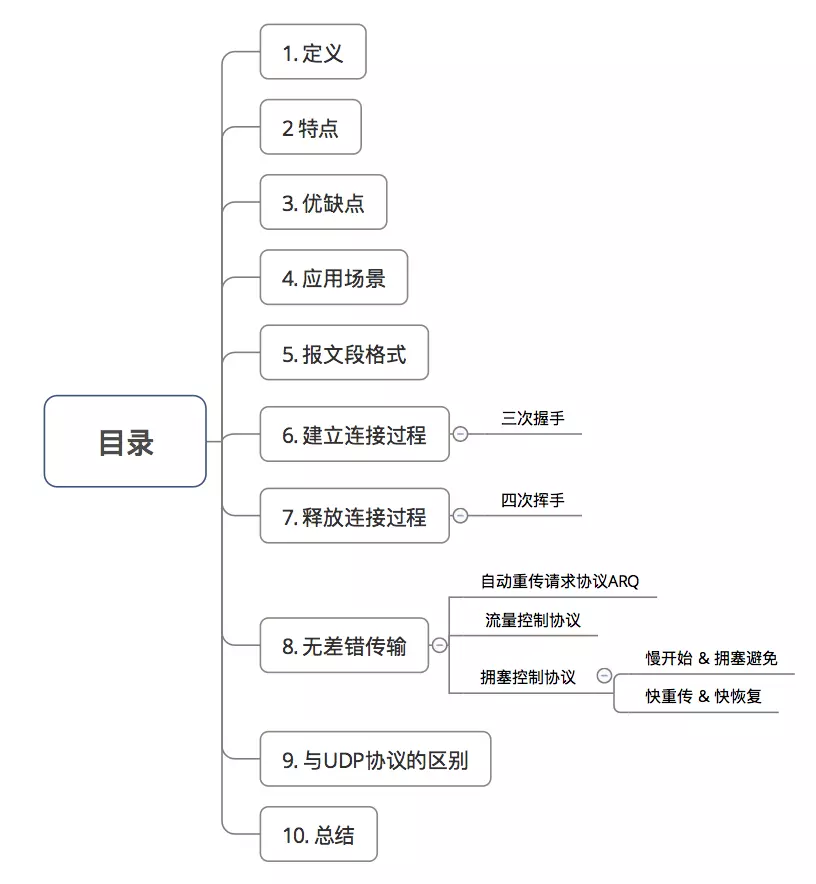

示意图

------

# 1. 定义

`Transmission Control Protocol`，即 传输控制协议

> 1. 属于 传输层通信协议
> 2. 基于`TCP`的应用层协议有`HTTP`、`SMTP`、`FTP`、`Telnet` 和 `POP3` 

------

# 2 特点

- 面向连接、面向字节流、全双工通信、可靠
- 具体介绍如下：

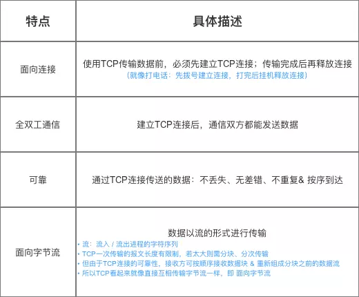

示意图

------

# 3. 优缺点

- 优点：数据传输可靠
- 缺点：效率慢（因需建立连接、发送确认包等）

------

# 4. 应用场景（对应的应用层协议）

要求通信数据可靠时，即 数据要准确无误地传递给对方

> 如：传输文件：HTTP、HTTPS、FTP等协议；传输邮件：POP、SMTP等协议

- 万维网：`HTTP`协议
- 文件传输：`FTP`协议
- 电子邮件：`SMTP`协议
- 远程终端接入：`TELNET`协议

------

# 5. 报文段格式

- TCP虽面向字节流，但传送的数据单元 = 报文段
- 报文段 = 首部 + 数据 2部分
- TCP的全部功能体现在它首部中各字段的作用，故下面主要讲解TCP报文段的首部

> 1. 首部前20个字符固定、后面有4n个字节是根据需而增加的选项
> 2. 故 TCP首部最小长度 = 20字节

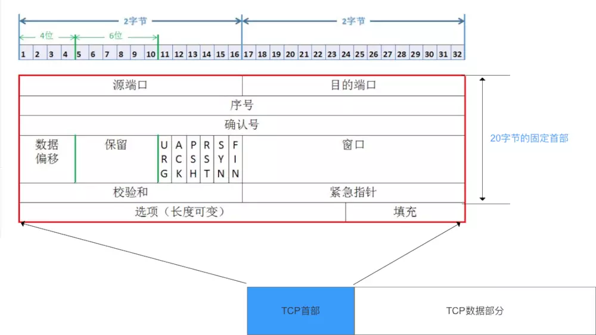

示意图

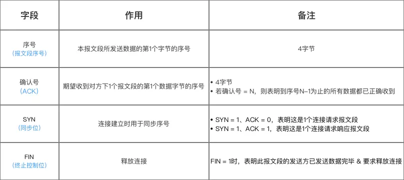

示意图

------

# 6. 建立连接过程

- TCP建立连接需 **三次握手** 
- 具体介绍如下

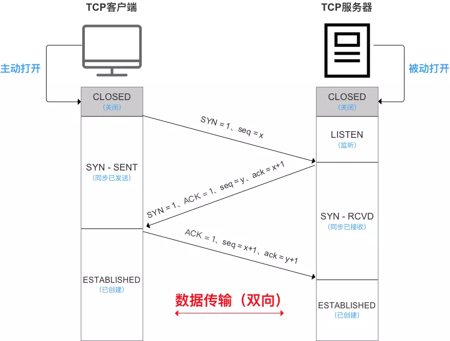

示意图

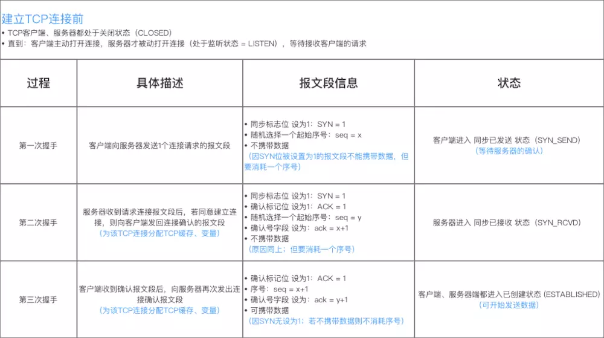

示意图

示意图

**成功进行TCP的三次握手后，就建立起一条TCP连接，即可传送应用层数据**

> 注
>
> 1. 因 `TCP`提供的是全双工通信，故通信双方的应用进程在任何时候都能发送数据
> 2. 三次握手期间，任何1次未收到对面的回复，则都会重发

### 特别说明：为什么TCP建立连接需三次握手？

- 结论
   防止服务器端因接收了**早已失效的连接请求报文**，从而一直等待客户端请求，最终导致**形成死锁、浪费资源**
- 具体描述

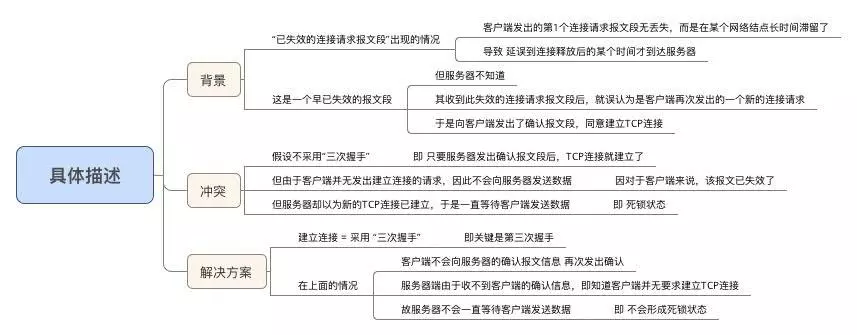

具体描述

> SYN洪泛攻击：
>
> - 从上可看出：服务端的TCP资源分配时刻 = 完成第二次握手时；而客户端的TCP资源分配时刻 = 完成第三次握手时
> - 这就使得服务器易于受到`SYN`洪泛攻击，即同时多个客户端发起连接请求，从而需进行多个请求的TCP连接资源分配

------

# 7. 释放连接过程

- 在通信结束后，双方都可以释放连接，共需 **四次挥手** 
- 具体如下

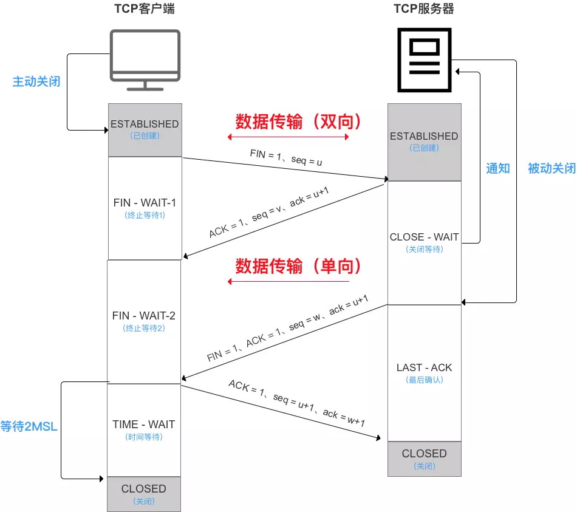

示意图

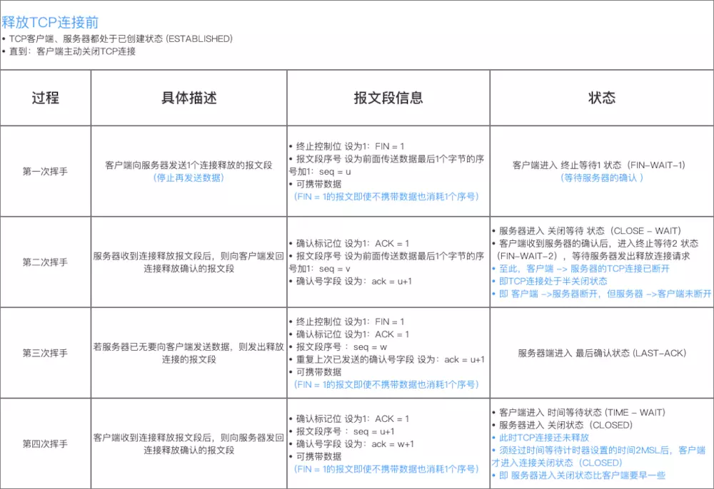

示意图

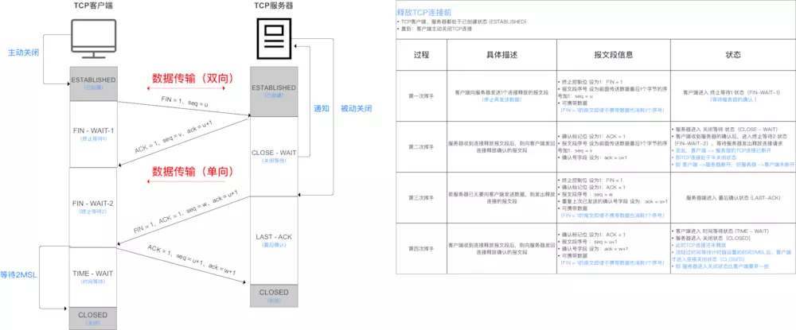

示意图

### 特别说明：为什么TCP释放连接需四次挥手？

- 结论
   为了保证通信双方都能通知对方 需释放 & 断开连接

> 即释放连接后，都无法接收 / 发送消息给对方

- 具体描述

示意图

> 延伸疑问：为什么客户端关闭连接前要等待2MSL时间？
>
> 1. 即 `TIME - WAIT` 状态的作用是什么；
> 2.  `MSL` = 最长报文段寿命（`Maximum Segment Lifetime`）

- 原因1：为了保证客户端发送的最后1个连接释放确认报文 能到达服务器，从而使得服务器能正常释放连接

示意图

- 原因2：防止 上文提到的早已失效的连接请求报文 出现在本连接中
   客户端发送了最后1个连接释放请求确认报文后，再经过2`MSL`时间，则可使本连接持续时间内所产生的所有报文段都从网络中消失。

> 即 在下1个新的连接中就不会出现早已失效的连接请求报文

------

# 8. 无差错传输

- 对比于`UDP`，`TCP`的传输是可靠的、无差错的
- 那么，为什么`TCP`的传输为什么是可靠的、无差错的呢？
- 下面，我将详细讲解`TCP`协议的无差错传输

### 8.1 含义

- 无差错：即 传输信道不出差错
- 发送 & 接收效率匹配：即 无论发送方以多快的速度发送数据，接收方总来得及处理收到的数据

### 8.2 基础：滑动窗口 协议

- 先理解2个基础概念：发送窗口、接收窗口

示意图

- 工作原理
   对于发送端：

1. 每收到一个确认帧，发送窗口就向前滑动一个帧的距离
2. 当发送窗口内无可发送的帧时（即窗口内的帧全部是已发送但未收到确认的帧），发送方就会停止发送，直到收到接收方发送的确认帧使窗口移动，窗口内有可以发送的帧，之后才开始继续发送
    具体如下图：

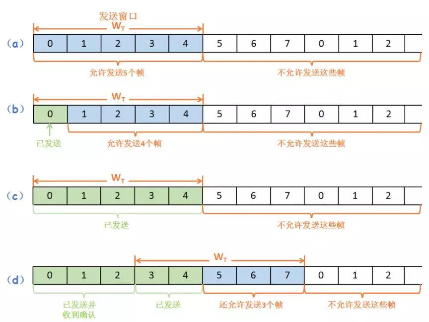

示意图

对于接收端：当收到数据帧后，将窗口向前移动一个位置，并发回确认帧，若收到的数据帧落在接收窗口之外，则一律丢弃。

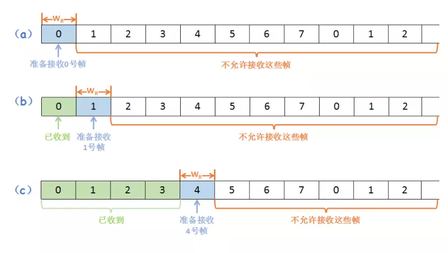

示意图

### 滑动窗口 协议的重要特性

- 只有接收窗口向前滑动、接收方发送了确认帧时，发送窗口才有可能（只有发送方收到确认帧才是一定）向前滑动
- 停止-等待协议、后退N帧协议 & 选择重传协议只是在发送窗口大小和接收窗口大小上有所差别：

> 1. 停止等待协议：发送窗口大小=1，接收窗口大小=1；即 单帧滑动窗口 等于 停止-等待协议
> 2. 后退N帧协议：发送窗口大小>1，接收窗口大小=1。
> 3. 选择重传协议：发送窗口大小>1，接收窗口大小>1。

- 当接收窗口的大小为1时，可保证帧有序接收。
- 数据链路层的滑动窗口协议中，窗口的大小在传输过程中是固定的（注意要与TCP的滑动窗口协议区别）

### 8.3 实现无差错传输的解决方案

核心思想：采用一些可靠传输协议，使得

1. 出现差错时，让发送方重传差错数据：即 出错重传
2. 当接收方来不及接收收到的数据时，可通知发送方降低发送数据的效率：即 速度匹配

- 针对上述2个问题，分别采用的解决方案是：自动重传协议 和 流量控制 & 拥塞控制协议

### 解决方案1：自动重传请求协议ARQ（针对 出错重传）

- 定义
   即 `Auto Repeat reQuest`，具体介绍如下：

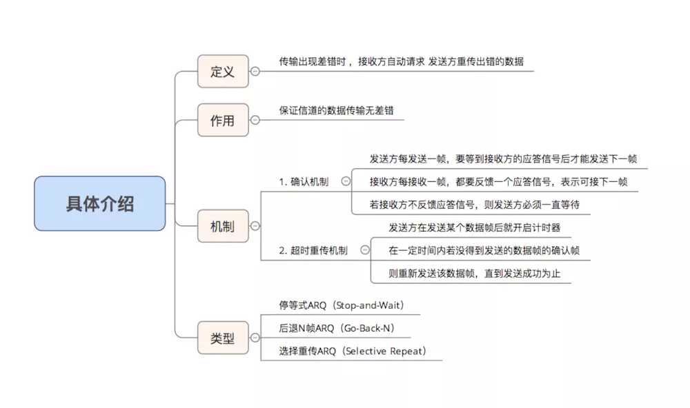

示意图

- 类型

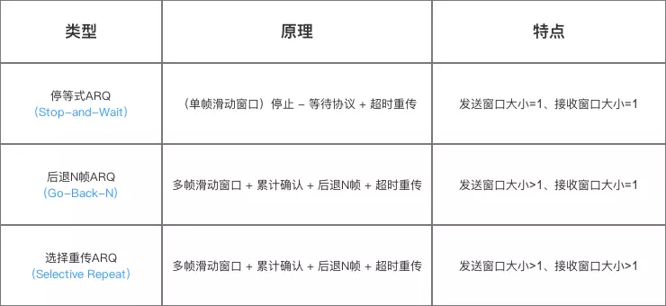

示意图

下面，将主要讲解 上述3类协议

### 类型1：停等式ARQ（Stop-and-Wait）

- 原理：（单帧滑动窗口）停止 - 等待协议 + 超时重传

> 即 ：发送窗口大小=1、接收窗口大小=1

- 停止 - 等待协议的协议原理如下：

> 1. 发送方每发送一帧，要等到接收方的应答信号后才能发送下一帧
> 2. 接收方每接收一帧，都要反馈一个应答信号，表示可接下一帧
> 3. 若接收方不反馈应答信号，则发送方必须一直等待

### 类型2：后退N帧协议

也称：连续ARQ协议

- 原理
   多帧滑动窗口 + 累计确认 + 后退N帧 + 超时重传

> 即 ：发送窗口大小>1、接收窗口大小=1

- 具体描述
   a. 发送方：采用多帧滑动窗口的原理，可连续发送多个数据帧 而不需等待对方确认
   b. 接收方：采用 **累计确认 & 后退N帧**的原理，只允许按顺序接收帧。具体原理如下：

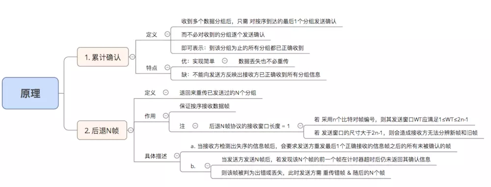

示意图

### 示例讲解

本示例 = 源站 向 目的站 发送数据帧。具体示例如下：

示意图

### 类型3：选择重传ARQ（Selective Repeat）

- 原理
   多帧滑动窗口 + 累计确认 + 后退N帧 + 超时重传

> 即 ：发送窗口大小>1、接收窗口大小>1

类似于类型2（后退N帧协议），此处仅仅是接收窗口大小的区别，故此处不作过多描述

- 特点
   a. 优：因连续发送数据帧而提高了信道的利用率
   b. 缺：重传时又必须把原来已经传送正确的数据帧进行重传（仅因为这些数据帧前面有一个数据帧出了错），将导致传送效率降低

> 由此可见，若信道传输质量很差，导致误码率较大时，后退N帧协议不一定优于停止-等待协议

# 解决方案2：流量控制 & 拥塞控制（针对 速度匹配）

### 措施1：流量控制

- 简介

示意图

- 示例

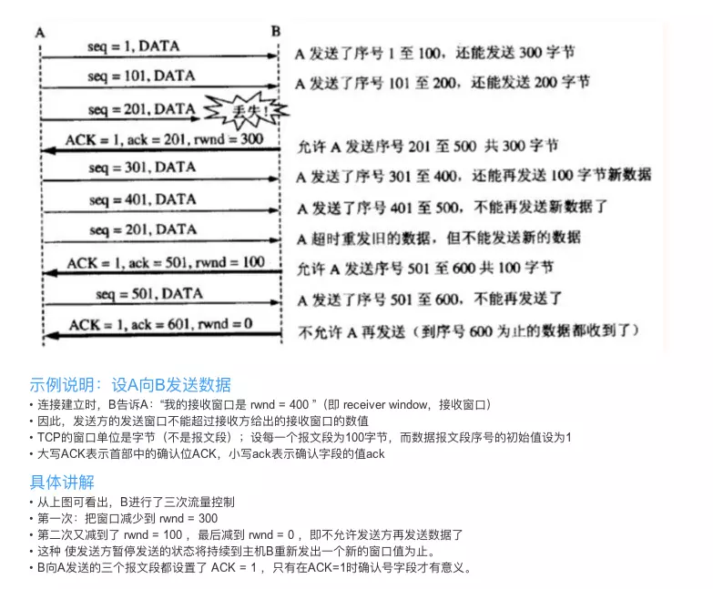

示意图

- 特别注意：死锁问题

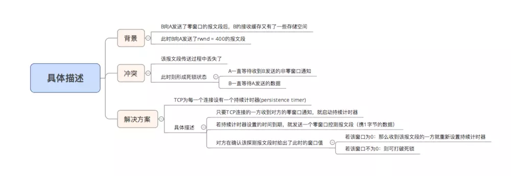

示意图

------

### 措施2：拥塞控制

- 定义
   防止过多的数据注入到网络中，使得网络中的路由器 & 链路不致于过载

> 拥塞：对网络中的资源需求 > 该资源所能提供的部分

- 与 “流量控制”的区别

示意图

- 具体解决方案
   共分为2个解决方案：慢开始 & 拥塞避免、快重传 & 快恢复

> 其中，涉及4种算法，即 慢开始 & 拥塞避免、快重传 & 快恢复

具体介绍如下

# 解决方案1：慢开始 & 拥塞避免

### 1.1 储备知识：拥塞窗口、慢开始算法、拥塞避免算法

### a. 拥塞窗口

- 发送方维持一个状态变量：拥塞窗口`（cwnd， congestion window ）`，具体介绍如下

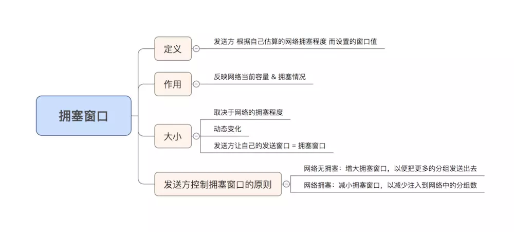

示意图

### b. 慢开始算法

- 原理
   当主机开始发送数据时，由小到大逐渐增大 拥塞窗口数值（即 发送窗口数值），从而 由小到大逐渐增大发送报文段
- 目的
   开始传输时，**试探**网络的拥塞情况
- 具体措施

示意图

- 示意图

示意图

- 特别注意
   慢开始的“慢”指：一开始发送报文段时拥塞窗口`（cwnd）`设置得较小（为1），使得发送方在开始时只发送一个报文段（目的是试探一下网络的拥塞情况）

> 并不是指拥塞窗口`（cwnd）`的增长速率慢

### c. 拥塞避免 算法

- 原理
   使得拥塞窗口`（cwnd）`**按线性规律 缓慢增长**：每经过一个往返时间`RTT`，发送方的拥塞窗口`（cwnd）`加1

> 1.  **拥塞避免 并不可避免拥塞**，只是将拥塞窗口按现行规律缓慢增长，使得网络比较不容易出现拥塞
> 2. 相比慢开始算法的加倍，拥塞窗口增长速率缓慢得多

- 示意图

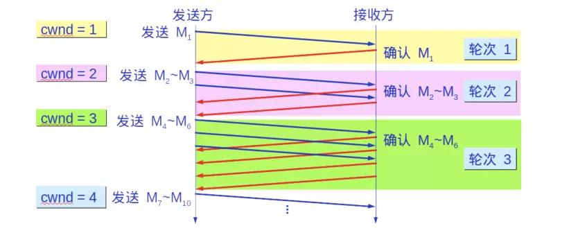

示意图

### 1.2 解决方案描述（慢开始 & 拥塞避免）

- 为了防止拥塞窗口`（cwnd）`增长过大而引起网络拥塞，采用慢开始 & 拥塞避免 2种算法，具体规则如下

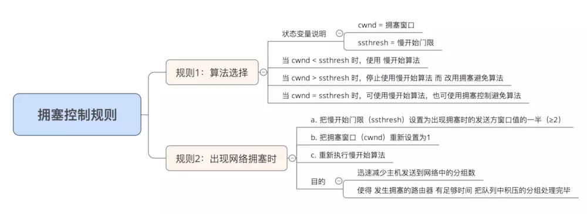

示意图

- 实例说明

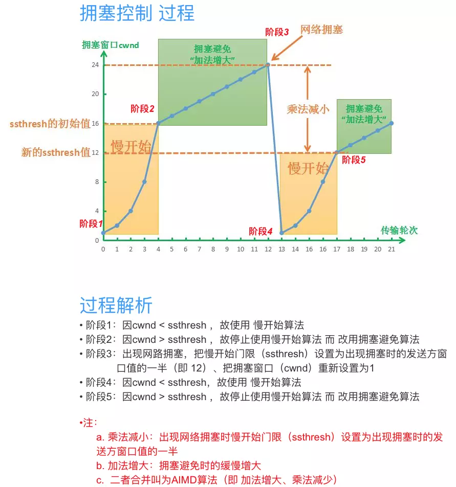

示意图

# 解决方案2：快重传 & 快恢复

快重传 & 快恢复的解决方案 是对慢开始 & 拥塞避免算法的改进

### 2.1 储备知识：快重传算法、快恢复算法

### a. 快重传算法

- 原理
  1. 接收方 每收到一个失序的报文段后 就立即发出重复确认（为的是使发送方及早知道有报文段没有到达对方），而不要等到自己发送数据时才进行捎带确认
  2. 发送方只要一连收到3个重复确认就立即重传对方尚未收到的报文段，而不必 继续等待设置的重传计时器到期
- 作用
   由于发送方尽早重传未被确认的报文段，因此采用快重传后可以使整个网络吞吐量提高约20%
- 示意图

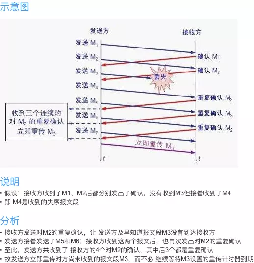

示意图

### b. 快恢复

当发送方连续收到3个重复确认后，就：

1. 执行 **乘法减小** 算法：把 慢开始门限`（ssthresh）`设置为 出现拥塞时发送方窗口值的一半 = 拥塞窗口的1半
2. 将拥塞窗口`（cwnd）`值设置为 慢开始门限`ssthresh`减半后的数值 = 拥塞窗口的1半
3. 执行 **加法增大** 算法：执行拥塞避免算法，使拥塞窗口缓慢地线性增大。

> 注：
>
> 1. 由于跳过了拥塞窗口`（cwnd）`从1起始的慢开始过程，所以称为：快恢复
> 2. 此处网络不会发生网络拥塞，因若拥塞，则不会收到多个重复确认报文

### 2.2 解决方案描述（快重传 & 快恢复）

- 原理
   为了优化慢开始 & 拥塞避免的解决方案，在上述方案中加入快重传 & 快恢复 2种算法，具体规则如下

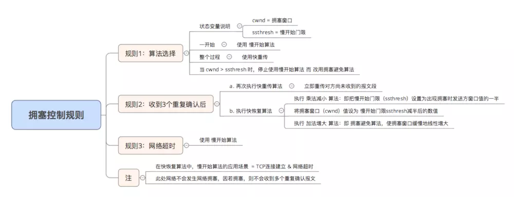

示意图

- 示意图

示意图

至此，关于`TCP`无差错传输的知识讲解完毕。

------

# 9. 与UDP协议的区别

示意图

# 10. 总结

- 本文全面讲解了 计算机网络中最重要的`TCP`协议，含其特点、三次握手、四次挥手、无差错传输等知识，相信你们对`TCP`协议已经非常了解

  

[转载]：https://www.jianshu.com/p/65605622234b

