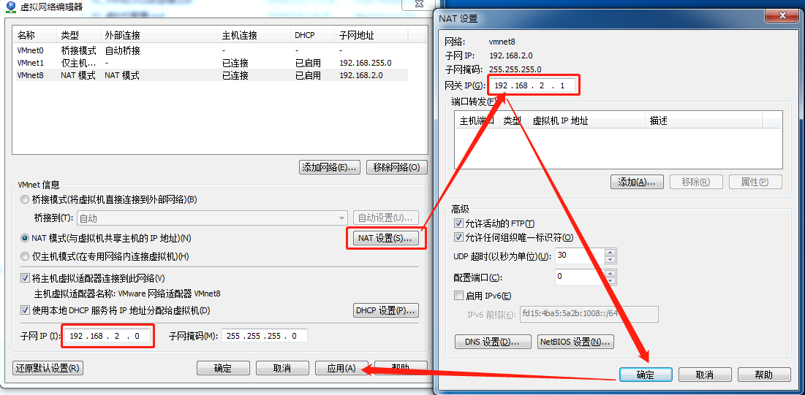
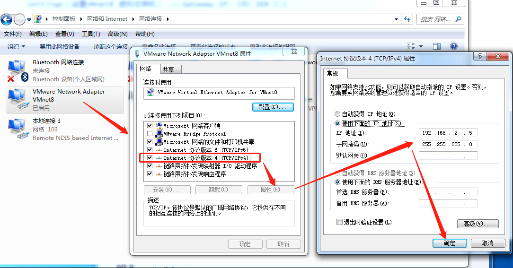
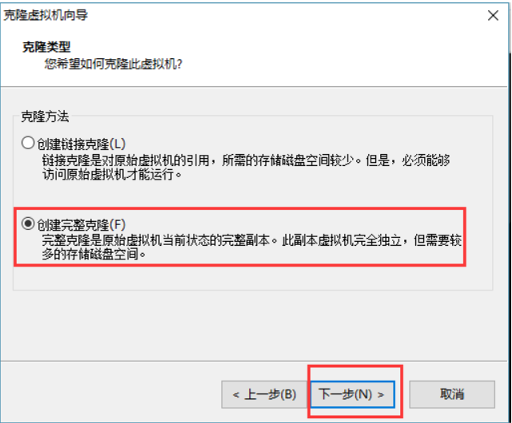
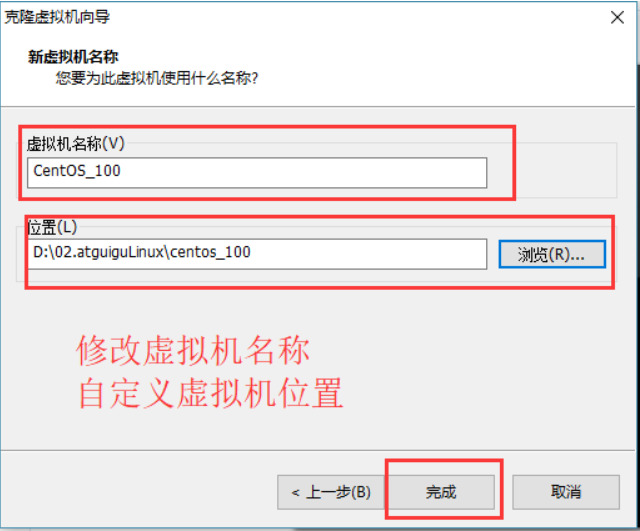
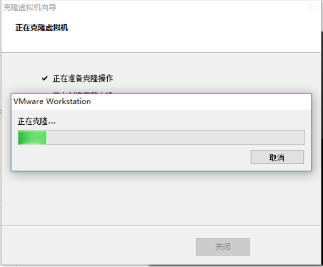

# 配置虚拟机

### 0 目录

[TOC]

> ### 如果是配置一台母机，则只进行网络配置、用户配置、主机名配置、关闭防火墙

### 1 网络配置

#### 1.1 虚拟网络编辑器配置

- VMware软件 -> Edit -> Virtual Network Editor -> 选择 VMnet8 -> 点击NAT Settings（设置VMnet8 虚拟交换机） -> Gateway IP: 192.168.2.1 



#### 1.2 VMnet8网络适配器配置

- 回到windows –> 打开网络和共享中心 -> 更改适配器设置 -> 右键VMnet8网络适配器 -> 属性 -> 双击IPv4 -> 设置虚拟网卡VMnet8的IP: 192.168.2.5 子网掩码: 255.255.255.0 (可选：默认网关: 192.168.2.1 首选DNS服务器: 192.168.2.1) -> 点击确定 



#### 1.3 配置主机IP

```
		通过su切换到root
        vi /etc/sysconfig/network-scripts/ifcfg-eth0
    
        DEVICE=eth0
        HWADDR=00:0C:29:3C:BF:E7       ###MAC地址
        TYPE=Ethernet
        UUID=ce22eeca-ecde-4536-8cc2-ef0dc36d4a8c
        ONBOOT=yes                     ###系统启动的时候网络接口是否有效（yes/no）
        NM_CONTROLLED=yes
        BOOTPROTO=static               ###IP静态分配

        IPADDR=192.168.2.101           ###IP地址
        GATEWAY=192.168.2.1            ###网关
        DNS1=192.168.2.1               ###域名解析器
```

#### 1.4 重启网络

```
		通过su切换到root
		service network restart
		如果报错，reboot,重启虚拟机
```

#### 1.5 测试主机之间的网络连通性

```
		ping 目的主机
```

### 2 用户配置

#### 2.1 新建用户组和用户

```
		通过su切换到root
		groupadd hadoop           
		useradd -g hadoop hinoc 
		passwd hinoc 
```

#### 2.2 把当前用户添加到sudoers

- 配置hinoc用户具有root权限

```
		通过su切换到root
		vi /etc/sudoers 
		## Allow root to run any commands anywhere 
		root ALL=(ALL) ALL 
		hinoc ALL=(ALL) ALL 
		：wq!
		(该项配置大概在第27行)
```

### 3 主机名配置

#### 3.1 修改主机名称

- 每台机器都要修改该名称，方便记忆标识和hosts地址映射

```
		sudo vim /etc/sysconfig/network

		NETWORKING=yes
		HOSTNAME=hadoop101    
```

- 修改主机名称后不会立即生效，需要执行sudo hostname hadoop101,或者重启设备

#### 3.2 修改主机名和IP的映射关系

```
		sudo vim /etc/hosts

		192.168.2.101   hadoop101
		192.168.2.102   hadoop102
```

- 这里可以多配置几台，如果你打算配置5台来组成分布式集群，这里就映射5台

### 4 关闭防火墙

```
    查看防火墙状态
    sudo service iptables status
    #关闭防火墙
    sudo service iptables stop
    #查看防火墙开机启动状态
    sudo chkconfig iptables --list
    #关闭防火墙开机启动
    sudo chkconfig iptables off
```

### 5 配置ssh免密登陆

> 在hadoop101上使用hinoc帐户设置ssh免密登录到hadoop102上

#### 5.1 生成ssh免登陆密钥

```
	进入到我的home目录 
	cd ~/.ssh 
	ssh-keygen -t rsa 
	（四个回车）执行完这个命令后，会生成两个文件id_rsa（私钥）、id_rsa.pub（公钥） 
```

#### 5.2 将公钥拷贝到要免密登陆的目标机器上

```
	> 比如：要在hadoop101上免密码登录hadoop102，那么就在hadoop101上面操作，然后把公钥复制到hadoop102上面，也可以把公钥复制到本机
	> ssh-copy-id localhost #localhost 是主机名称或则ip地址
```

#### 5.3 ssh密钥验证原理图 


### 6 克隆虚拟机

> 母机配置好后不要使用，专门用于克隆

#### 6.1 关闭要被克隆的虚拟机

#### 6.2 找到克隆选项


#### 6.3 欢迎页面


#### 6.4 克隆虚拟机


#### 6.5 设置创建完整克隆



#### 6.6 设置克隆的虚拟机名称和存储位置



- 虚拟机名称和主机名可以不一致
#### 6.7 等待正在克隆



#### 6.8 点击关闭，完成克隆


#### 6.9 修改克隆后虚拟机IP


#### 6.10 修改IP地址

```
		[root@hadoop101 /]#vim /etc/sysconfig/network-scripts/ifcfg-eth0
		
		HWADDR=00:0c:29:34:c4:3f
		IPADDR=192.168.2.102
```

#### 6.11 修改主机名称

- 主机名称修改为hadoop102,要与/etc/hosts保持一致,详见“3.1修改主机名称”

#### 6.12 重新启动设备

### 7 安装JDK

> 示例中，使用的用户名为atguigu，使用的用户组名为 atguigu

#### 7.1 在/opt目录下创建文件夹

##### 7.1.1 在/opt目录下创建module、software文件夹

```
		[atguigu@hadoop101 opt]$ sudo mkdir module
		[atguigu@hadoop101 opt]$ sudo mkdir software
```

##### 7.1.2 修改module、software文件夹的所有者

```

		[atguigu@hadoop101 opt]$ sudo chown atguigu:atguigu module/ software/
		[atguigu@hadoop101 opt]$ ll
		总用量 8
		drwxr-xr-x. 2 atguigu atguigu 4096 1月  17 14:37 module
		drwxr-xr-x. 2 atguigu atguigu 4096 1月  17 14:38 software
```

#### 7.2 卸载现有JDK

##### 7.2.1 查询是否安装Java软件：

```
		[atguigu@hadoop101 opt]$ rpm -qa | grep java
```
##### 7.2.2 如果安装的版本低于1.7，卸载该JDK：

```
		[atguigu@hadoop101 opt]$ sudo rpm -e 软件包
		
		卸载示例：
		[atguigu@hadoop101 opt]$ rpm -qa | grep java
		tzdata-java-2014i-1.el7.noarch
		java-1.7.0-openjdk-headless-1.7.0.71-2.5.3.1.el7_0.x86_64
		java-1.7.0-openjdk-1.7.0.71-2.5.3.1.el7_0.x86_64

		[atguigu@hadoop101 opt]$ sudo rpm -e --nodeps tzdata-java-2014i-1.el7.noarch
		[atguigu@hadoop101 opt]$ sudo rpm -e --nodeps java-1.7.0-openjdk-headless-1.7.0.71-2.5.3.1.el7_0.x86_64
		[atguigu@hadoop101 opt]$ sudo rpm -e --nodeps java-1.7.0-openjdk-1.7.0.71-2.5.3.1.el7_0.x86_64
```

##### 7.2.3 查看JDK安装路径：

```
[atguigu@hadoop101 ~]$ which java
```

#### 7.3 导入JDK安装包

- 用SecureCRT工具将JDK导入到opt目录下面的software文件夹下面，如图2-28所示


											图2-28  导入JDK

- “alt+p”进入sftp模式，如图2-29所示


											图2-29 进入sftp模式

- 选择jdk1.8拖入，如图2-30，2-31所示


											图2-30 拖入jdk1.8


											图2-31 拖入jdk1.8完成

#### 7.4 在Linux系统下的opt目录中查看软件包是否导入成功

```
		[atguigu@hadoop101 opt]$ cd software/
		[atguigu@hadoop101 software]$ ls
		hadoop-2.7.2.tar.gz  jdk-8u144-linux-x64.tar.gz
```

#### 7.5 解压JDK到/opt/module目录下

```
		[atguigu@hadoop101 software]$ tar -zxvf jdk-8u144-linux-x64.tar.gz -C /opt/module/
```

#### 7.6 配置JDK环境变量

##### 7.6.1 先获取JDK路径

```
		[atguigu@hadoop101 jdk1.8.0_144]$ pwd
		/opt/module/jdk1.8.0_144
```

##### 7.6.2 打开/etc/profile文件

```
		[atguigu@hadoop101 software]$ sudo vi /etc/profile

		在profile文件末尾添加JDK路径:
		#JAVA_HOME
		export JAVA_HOME=/opt/module/jdk1.8.0_144
		export PATH=$PATH:$JAVA_HOME/bin
```

##### 7.6.3 保存后退出

```
		:wq
```

##### 7.6.4 让修改后的文件生效

```
		[atguigu@hadoop101 jdk1.8.0_144]$ sudo source /etc/profile
```

#### 7.7 测试JDK是否安装成功

```
		[atguigu@hadoop101 jdk1.8.0_144]# java -version
		java version "1.8.0_144"
		注意：重启（如果java -version可以用就不用重启）
		[atguigu@hadoop101 jdk1.8.0_144]$ sync
		[atguigu@hadoop101 jdk1.8.0_144]$ sudo reboot
```
